# Mixture of experts 

## Environnement de travail 
[use_grid_5000](./use_grid_5000.md)

## Objectifs et motivations
- prédiction des experts utilisés pour un token (prédiction spatiale): pour pouvoir charger les experts en avance notamment
- prédiction des experts entre token (prédiction temporelle) : à la couche l du token t on veut savoir quels experts on utilisera à la couche l du token t+1. Ca permet de savoir quels experts on garde en mémoire
- explicabilité : le mécanisme de routage, la spécialisation ou non des experts. On aimerait mieux comprendre comment tout ça se passe.

## Ressources 
- dossier `biblio`
- [Mixture of Experts: A Smarter Way to Train AI Models (IBM)](https://www.ibm.com/think/topics/mixture-of-experts)
- [AI Expert Speculates on GPT-4 Architecture (wandb.ai)](https://wandb.ai/byyoung3/ml-news/reports/AI-Expert-Speculates-on-GPT-4-Architecture---Vmlldzo0NzA0Nzg4)

## modèles utilisés
- Mixtral 8x7B :  
    - 47B parameters (as some are shared between experts), 
    - 13B active for inference
    - 32 couches, deux experts parmi 8
    - via hugging_face/transormers
    - ~45 GB en 16bit

## Solutions pour la prédiction d'experts dans llm moe  
- (1) utilisation des gating functions des couches suivantes (prédiction spatiale)
- (2) réseau entrainé pour prédire à partir du token
- (3) corrélation/causalité entre paires d'experts

### 1 - Gating function
_Prédictions horizontale (spaciale)_
On se place à la couche _k_ et on évalue le hidden vector (sortie de l'attention) avec la gatting function de la couche _k+n_ pour une prédiction à de _n_ couches dans le futur.
On regarde les prédictions top-1 et top-2. Pour top-1 on regarde si l'expert avec la meilleure prédiction se trouve bien dans la paire d'experts utilisés en réalité. Pour top-2 enregistre un hit si un deux experts prédits et utilisés et deux hit si la paire prédite et la même que la paire utilisée. 
++ : précision ok (96%, 90%) poir le top-1 et autour de 85% pour top 2 avec _n=1_ 
-- : demande de relier les couches entre elles mais temps de calcul négligeable par rapport aux calculs des experts et gain de temps ++
Pour preload les experts on le ferait techniquement juste à la couche d'avant, c'est donc ce taux de réussite qui nous interresse le plus.

Idée d'amélioration : 

### 2 - Réseau 
Ca peut être une prédiction et spatiale et temporelle 
Attention à la taille du réseau utilisé, on ne veut pas un 'bazooka' pour tuer un moustique. Cela permet sans doute une précision intéressante mais on perd le côté explicabilité et on n'en apprends pas plus sur les experts. regarder si expertflow serieux.

### 3 - Statistiques
On s'intéresse à la causalité ou la corrélation entre les paires d'experts utilisés entre couche puis entre token. Une piste est de trouver une loi conjointe expérimentale entre X et Y (et Z et +), X et Y 
étant les variables aléatoires des paires d'experts choisis pour deux couches consécutives (alphabet de (8 2) = 28).

to do 
- tracer la matrice de corrélation entre X et Y avec du comptage (puis étendre à Z) puis distribution jointe empirique 
- regarder les métriques pour exploiter ça (3 types de corrélation, bi-clustering)

## Méthodes 

### Matrice de co-occurence
Avec Stat_experts.py on calcule le nombre de fois que chaque couple d'experts de la couche A et utilisés par la couche B. Je veux normaliser ce résultat sur [0,1]. On peut soit normaliser la matrice par ligne, par colonne ou toute la matrice directement. 

#### Normalisation par ligne
Lorsque l'on normalise la matrice de co-occurrence (28x28) **par ligne**, on calcule une probabilité conditionnelle de la forme :
**P(couple_j à la couche L+1 | couple_i à la couche L)**
Donc on mesure la probabilité que le couple d’experts j soit activé en couche L+1, **sachant** que le couple i l’a été en couche L.
La normalisation par ligne est utile pour :
- étudier les **transitions inter-couches** dans un modèle MoE ;
- analyser le **comportement dynamique du routeur** ;
- construire des **trajectoires de routing** couche par couche.

Cette approche peut être trompeuse si on l'interprète seule.
Par exemple, un couple i **très rarement activé** peut, à chaque fois ou presque mener au même couple j.  
Dans ce cas :
- La **probabilité conditionnelle** P(j | i) sera proche de 1
- Mais la **probabilité jointe** P(i → j) = P(i) × P(j | i) sera **très faible**

> on observe un lien très fort entre i et j, mais ce chemin est **statistiquement très rare** (donc pas useful)

#### Normalisation sur toute la matrice
SI on normalise la matrice de co-occurrence (28x28) **sur l'ensemble de ses éléments**, on obtient une **probabilité jointe** :
**P(couple_i à la couche L et couple_j à la couche L+1)**
A haque case (i, j) de la matrice donne directement la **fréquence absolue** du chemin i → j dans les données.

Cette approche est utile pour :
- identifier les **transitions réellement fréquentes** dans le modèle ;
- **pondérer les liens conditionnels** avec leur fréquence d’occurrence ;
- détecter les **chemins dominants** dans la dynamique globale du routing.

La probabilité jointe intègre **à la fois la probabilité de départ (P(i)) et la conditionnelle (P(j | i))**, ce qui permet de :
- éviter de surinterpréter des chemins rares,
- **quantifier l’importance réelle** d’un chemin i → j.
Mais dcp elle ne permet pas de détecter **régularités locales** ou des règles de transition, car elle ne tient pas compte du conditionnement.  

> Un couple j peut apparaître très souvent simplement parce qu’il est populaire globalement, **sans dépendre de i**.

#### Visualisation et résultats
On trace donc la matrice de co-occurence avec les deux types de normalisation. 

### Heatmap d'utilisation des experts
On trace l'utilisation des experts en fonctions des couches à partir des trajectoires. On prend ici les trajectoires qui nous intéresse, soit pour l'ensemble des token : 
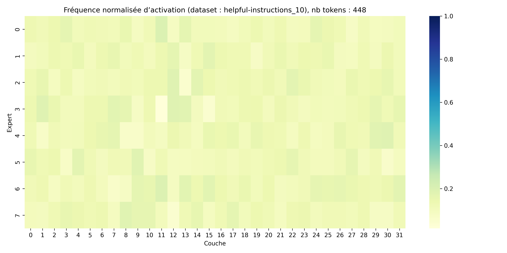 *Utilisation des experts en fonctions de la couche pour le dataset Helpful-instructions*  
On observe bien que même pour un nombre restreint de d'entrée (ici 10 prompts => 448 tokens). On a une utilisation quasi-uniforme des experts à travers les couches. On retrouve ici le souhait d'équilibrer l'utilisation des experts lors de l'entrainement (notamment avec du router_noise) afin de tirer parti de l'ensemble des experts et donc de leurs poids.  
On peut aussi regarder les trajectoires d'un token donné, par exemple ici avec le token de start de chaque prompt :
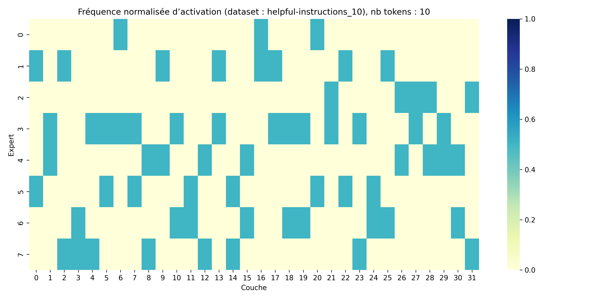 *Utilisation des experts en fonctions de la couche pour le dataset Helpful-instructions pour token de start*  
On a ici une heatmap déterministe avec une seule trajectoire qlq soit le token de start pris dans le dataset. C'est un résultat rassurant car lors du forward le contexte ne contient que le passé et donc ce token (au début donc contexte "vide") a tjrs le même contexte.   
On regarde maintenant au contraire le token 28725 (',') qui est dans des contextes très différents à chaque fois.
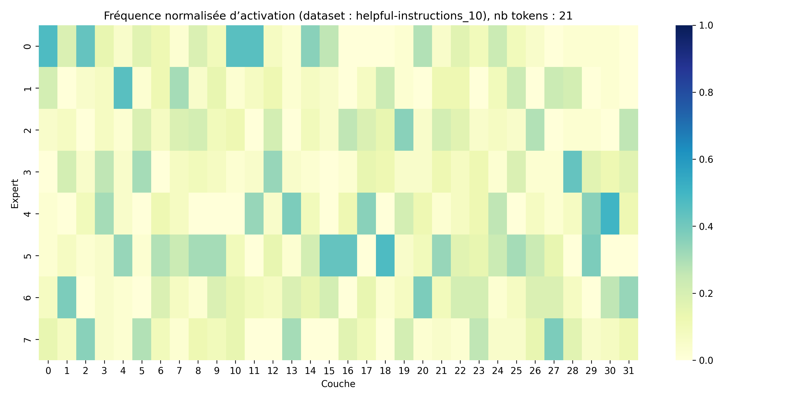 *Utilisation des experts en fonctions de la couche pour le dataset Helpful-instructions pour token ','*  
On a ici quelque chose de bcp plus 'flou', il n'y a pas une trajectoire qui sort du lot même si on peut observer des experts plus utilisés.   
On trace ici les statistiques avec pour seule info le token_id. Je veux regarder maintenant les trajectoires en ayant comme informartion le token_id du token qui m'intérrese mais aussi le token_id du token précédent. 
Je choisis donc un token en particulier : 28804 ('?') je regarde son utilisation des experts sans informations (je construit les trajectoires que pour ce token_id) :
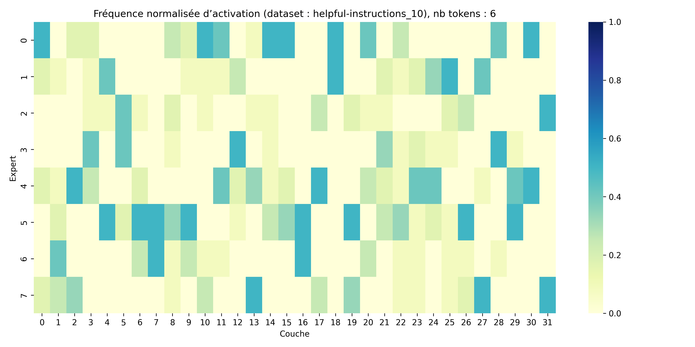 *Utilisation des experts en fonctions de la couche pour le dataset Helpful-instructions pour token '?'*  
On retrouve ici qlq chose de similaire que pour le token ',' car ce sont des token au cotexte très varié.  
On rajoute maintenant l'information du token_id précédent pour voir si on converge vers une trajectoire. 
Pour faire cella on cherche les token '?' dans data et on build sa trajectoire ssi le token_id du token précédent dans data et celui du toekn '_it' car dans ce petit dataset on a plusieurs fois l'enchainement '_it ?'. 378 et 28804
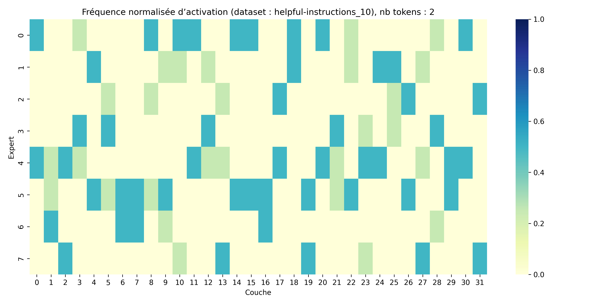 *Utilisation des experts en fonctions de la couche pour le dataset Helpful-instructions pour token '?'*  
Bon on a que deux token ou l'enchainement arrive donc pas assez representatif mais dans l'idée ca fait ce qu'on veut. On regarde maintenant sur un jeux de données bcp plus gros (10000 prompts => 630k tokens).
On regarde l'utilisation générale des tokens :  

On regarde pour un exemple seulement token_id puis token_id avec token_id précédent :
Dans notre exemple ici 'can' et 'I can', avec can l'entrée du forward où on essaye de prédire. A terme on essayera de se placer que en amont de ce token_id.
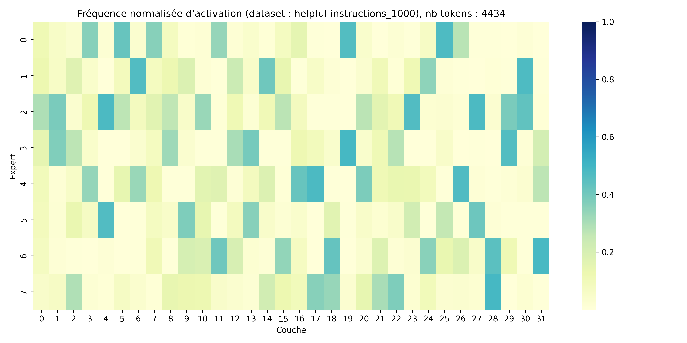 *Utilisation des experts en fonctions de la couche pour le dataset Helpful-instructions pour le token 'can' token_id = 541*   
On observe quelques pattern, il y a bien de l'information sur l'utilisation des experts dans le token id mais c'est pas suffisant.  
On rajoute donc l'information du token_id précédent ici avec 'I' par exemple (token_id = 315):
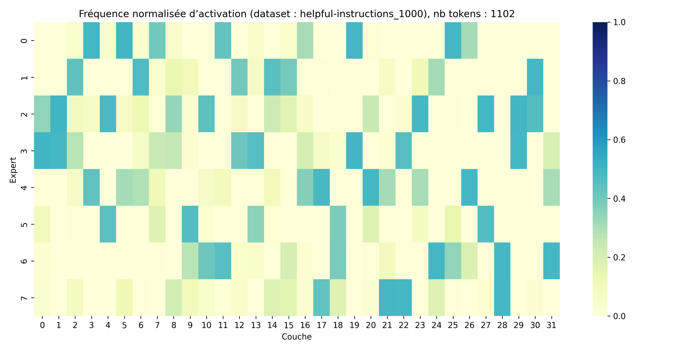 *Utilisation des experts en fonctions de la couche pour le dataset Helpful-instructions pour le token 'can' précédé du token 'I'*
La heatmap est plus marqué : on a une trajectoire plus claire qui se dessine mais qlq couches restent compliquées à exploiter : vers layer 16, 17.
On cherche donc une métrique pour exprimer cet apport d'informations. Une première approche simple mais très cohérante dans notre cas est le hit_rate. On prends comme prédiction les deux experts les plus probables statistiquement par couche et on compare avec la réalité. 

### Trajectoires 
Grâce à la matrice de co-occurence entre deux couches successives on a une information locale. On aimerait étenndre cette information sur l'ensemble des couches pour un token : analyse des trajectoires. 
On peut visualiser les trajectoires de plusieurs manières :
- réduction de la dimensions des données :
    - PCA
    - t-SNE
- Courbes 3D (E1, E2, layer) en refléchissant à dans quel ordre on range E1 et E2 
- courbes paramétrées f(E1(l), E2(l)) avec l in layer

#### Réduction de dimensions - flatten
Les algorithmes PCA et t-SNE servent à réduire la dimensions de vecteurs pour pouvoir les visualiser dans le plan et potentiellement faire de la segmentation. 
Pour utiliser ces algo il faut choisir nos vecteurs de départs. Nous avons à dispositions (récupéré depuis le modèle) pour chaque token :
- son token-id (sortie du tokenizer mixtral)
- les routeurs logits pour chaque token_id (32 couches * 8 logits)
- et donc les deux experts utilisés à chaque couche (32 couches * 2 experts_indices )
- l'embedding (4096 logits)
- hidden_vectors (32 * 4096 logits)
Pour ces deux algorithmes on veut un vecteur flatten (dim=N*1).
Pour cela on a plusieurs possibilité :
- vecteur de taille 2*32 = 64 contenant les indices des experts utilisés pour chaque couche  
Vecteur le plus petit que l'on puisse prendre qui contient l'information la plus importante (celle que l'on veut prédire). Il faut faire attention ou en tout cas refléchir à comment on ordonne E1 et E2 les deux experts de la couche l. Est-ce qu'on met tjrs l'expert le plus probable en premier : mais dcp (7, 3) != (3, 7) donc peut être pas très logique pcq pour la prédiction c'est presque la même chose pour nous. Ou alors on peut ordonner tjrs de la même manière en mettant par exemple l'indice le plus grand en premier ainsi (3,7) = (7,3). On perd icj l'information de l'expert le plus probable mais on harmonise les couples (28 couples possibles au lieux de 56). 
- vecteur de taille 32*8=256 conentnant les logits pour chaque expert pour chaque couche
- vecteur de taille 32*4=128 contenant les logits et indice des deux experts choisis pour chaque couche : mais jsp comment ranger ça

#### Réduction de dimensions - multidim
Ils existent aussi des algorithmes qui ne necessitent pas de flatten l'information en entrée (typiquement pour des images en RGB c'est mieux).

### Similarité des experts 
demandé papier à Pablo pour outils stat

## Calcul de la précision de la prédiction 
on run le modèle sur un dataset choisi (étudier l'effet du dataset en essayant pour différente dataset). On enregistre les experts (top-2) selectionnés ppur chaque token dans chaque couche.
On regarde à chaque fois si on a un hit (expert prédit in experts réalité). Et on a notre précision moyenne.

## Résultats

# Reunions MAJ

## semaine du 3 Juin
- papier de ELI : lien entre grammaire des tokens et trajectoires dans les routeurs (clusters par type de mot : noms, adj etc) visualisables avec tsne 
- regarder les trajectoires des tokens avec même id 
- stockage pour large dataset 
- heatmap : normalisation par ligne ou sur ensemble de la matrice ? (proba condi ou conjointe)

## semaine du 10 Juin
- demande stockage supp de 300G sur le home (en attente)
- on attends pour faire tourner sur un autre dataset dcp
- recode la génération des routers logits et hidden vectors + embbedings sans toucher à modeling
- recode des fonctions d'analyses pour s'adapter au nouveau format de generation
- visualisation des deux heatmaps
- visualisation pour 2 token_id (les deux plus présents dans mon échantillon) des experts les plus used
    - pas super marque voir pas du tout suivant le token_id et ce même 
    - **Pour le token de démarrage (token_id = 1) Instructions :**  
          
        *Heatmap illusatrant la fréquence d'utilisation des experts pour le token de démarrage (token_id = 1 pour) Instructions*
    - **Pour le token le plus fréquent (the) (token_id = 13) Instructions :**  
          
        *Heatmap illusatrant la fréquence d'utilisation des experts pour le token de démarrage (token_id = 13 pour) Instructions*

UP : figures pas bonnes donc deleted
Dans la heatmap du token d'initialisation on observe du bruit au moins dans la selection des experts de la couches 0. En effet à priori cette couche est déterministe car elle n'a pas d'autre contexte. On a vérifié et router_jitter_noise = 0.
On a créé [id_to_token](./outputs/prompt/id_to_token.pt) et [token_to_id](./outputs/prompt/token_to_id.pt) pour avoir les relations entre token_id et le vocabulaire.

- tester avec preposition particulière 
- vmap de 0 à 1 à forcer DONE : il faut retracer mais pas de ressources
- verifier couche 33 embeding
- jitter noise
- tsne : 32*8 flatten : tous en gris sauf selection de token en couleur : essayer enchainement de token (plus probable avant the +the)
write; actions dans instructions ; syntaxe vs nm variable

- ajouter info pour heatmap : prendre un token qui arrive souvent avant the et voir heatmap => essayer d'augmenter proba des traj en rajoutant de l'info

- plus tard : classificateur : obj. final

### Feuille de route :
- generate output pour trois dataset : helpful instr; code; autre à choisir. 
- analyse des token les plus used
- verifier que same(token_id) => same(embedding)
- regarder enchainement de token pour voir si ajout du contexte comme informations nous aide 
- regarder debut1 + mot1 et debut1 + mot2 si suivant la longueur de début ça nous aide à prédire la traj de mot et si c'est robuste aux variations. 
Recode PROPRE de toute la génération on ests ur que c'est good au moins. 

### 17 Juin
- on a du stockage, c'est cool mais j'arrive pas à accéder à group storage
- rennes full : checker lille
- il y a de l'info dans les token_id : on arrive a voir des pattern de trajectoires même en ayant juste le token_id d'entrée, encore plus si token_id d'entrée + celui d'avant. IL faut trouver une métrique pour mesurer ça : le hit rate est une première approche. On prend comme prédiction déterministe les top2 experts enregistrés dans nos data et on compare. 

On regarde le hit rate : 
- en ne connaissant que le token_id pour le token 'can' on a une prédiction de 70% : mesure à prendre avec des pincettes on prends comme prédiction la paire d'expert la plus probable statistiquement sur le dataset et après on test sur le même dataset => regarder sur un autre dataset en anglais
- en connaissant 'I' et 'can' on monte à 82.4% avec la même réserve que au dessus.
Le tokenizer de Mixtral a un vocabulaire de taille 32000 et sur le test à 10000 prompts on atteint 14923 token. il faudrait donc augmenter ou diversifier le dataset pour toucher le max de token. Pour l'instant on regarde juste des tokens qui souvent. 

On commence par créer u prédicteur de profondeur 1 : ce qu'on à déjà fait à la main pour qlq token on automatise.

- tsne to check pour visualisation et explicabilité
- prédicteur :
    - token_id d'entrée + n token_id avant : ça nous donne une prédiction déterministe mais trop lourd. On veut donc entrainé un PETIT prédicteur pour tirer parti des redondances avec en entrée 
    - sans le token_id d'entrée ! (objectif final) : on a donc n token_id précédent + hidden_vectors de la couche à laquelle on veut prédire par exemple. première étape on garde la dim 4096 mais ça serait cool de réduire (encodeur). Dans le hidden_vector à la couche l du token t-1 on commence à avoir l'information du token t mais faut regarder si embedding d'input = embedding d'output pour pouvoir utiliser  le rapport token_id <=> embedding  
    

### update

Cette semaine, j’ai continué à travailler sur la prédiction des experts activés dans un modèle Mixture of Experts, avec l’objectif de mieux comprendre et éventuellement anticiper les chemins de routage (`routing paths`) associés aux tokens pendant l’inférence.

## Étape 1 : Prédicteur statistique simple (profondeur 1)

J’ai commencé par coder un petit prédicteur très simple : pour chaque `token_id`, je regarde dans les données collectées (trajectoires d’experts) quelles sont les paires d’experts les plus souvent activées, couche par couche. Je garde ensuite la paire la plus fréquente pour chaque couche. Ce prédicteur de profondeur 1 donne une base intéressante. Il est naïf, mais pas si mauvais sur les tokens fréquents.
On regarde ses résultats sur les 100 tokens les plus vu dans data. C'est une première estimation des perf, ça nous permet de regarder si on a de l'info rien que dans le token_id d'entrée.
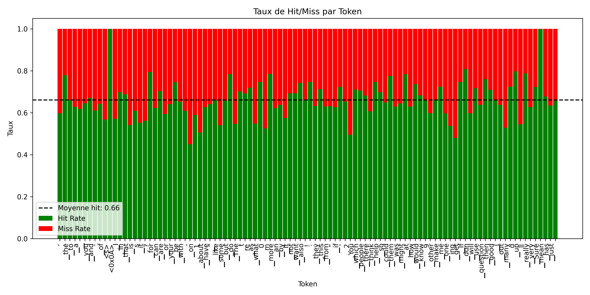  
*Précision du prédicteur statistique (profondeur 1) sur les 100 tokens les plus fréquents : pour chaque token, on affiche le taux de réussite (hit rate) couche par couche.*
La précision ici est basée sur le top-2 experts : 100% de précision => 32 * 2 experts correctement prédits = toute la trajectoire est correcte. On observe que pour les tokens les plus fréquents, on arrive à une précision de 66% en moyenne sur les 32 couches, ce qui montre qu'il y a bien de l'information dans le token_id seul. 
Ca nous donne donc envie de rajouter de l'information avec les token_id précédent pour voir si on arrive à améliorer ça.

J’ai aussi regardé la précision en fonction de la couche. 
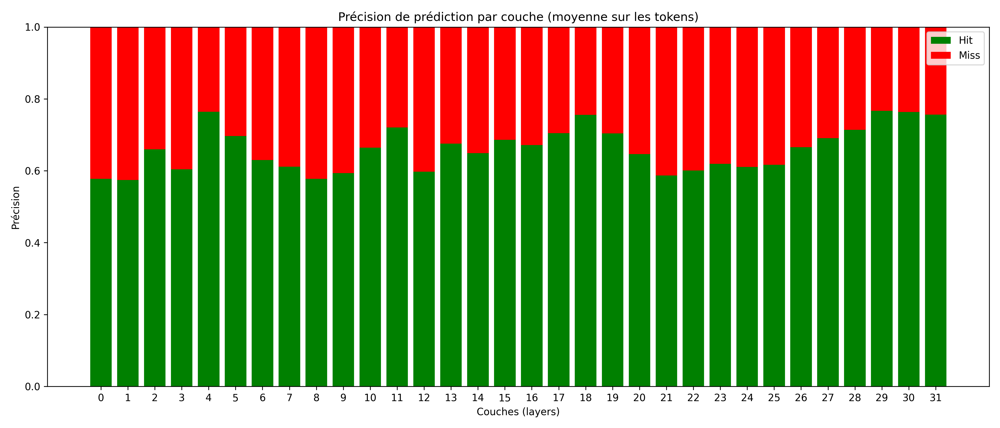

J'ai essayé au max de parralleriser la construction du predicteur pour utiliser tous les coeurs de calcul (machien du DER SIEN). Ca va bcp plus vite et en plus j'ai découvert un peu comment ça marché youhou.

## Étape 2 : Extension à une profondeur supérieure 

Dans un second temps, j’ai commencé à construire un prédicteur un peu plus contextuel : l’idée est de passer de `token_id` seul à `(...,token_{t-1}, token_t)` comme entrée. Cela revient à travailler sur des k-uplets de tokens successifs. Pour chaque uplets, je vais chercher la paire d’experts la plus probable à chaque couche.

Techniquement, c’est assez simple à mettre en place car j’ai déjà toutes les trajectoires dans les fichiers générés précédemment. Le plus dur, en fait, c’est la **taille de l’espace des paires**. Il y a potentiellement `|V|²` possibilités (avec V = taille du voc, plusieurs millions si on considère un vocabulaire large). On commence à faire ça pour Np paires voir si c'est intéressant déja. Le but ensuite est d'entrainer un modèle léger pour prédire ces paires d’experts en fonction des tokens précédents afin de réduire la taille de l’espace de recherche.

J’ai donc commencé à implémenter cette approche pour les 100 uplets les plus fréquents dans les données. J'ai regardé pour une profondeur de 2 et 3.
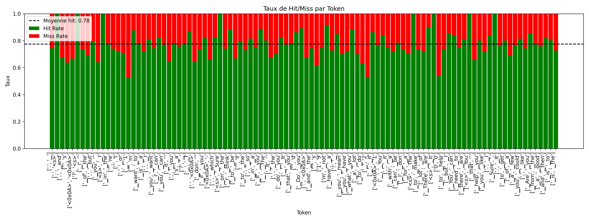
**Précision du prédicteur statistique (profondeur 2) sur les 100 uplets les plus fréquents : pour chaque uplet, on affiche le taux de réussite (hit rate) couche par couche.**
On observe que la précision augmente avec la profondeur.

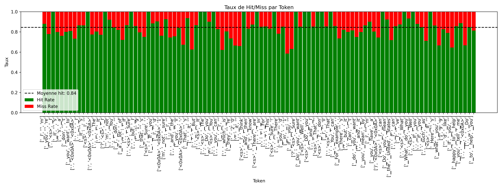
**Précision du prédicteur statistique (profondeur 3) sur les 100 uplets les plus fréquents : pour chaque uplet, on affiche le taux de réussite (hit rate) couche par couche.**
On voit que la précision augmente encore.

Cette approche nous permet de savoir ou se trouve l'information et si on peut l'exploiter mais reste à prendre avec des pincettes, on regardes les statistiques d'un jeu de données et on prédit sur le même jeu de donnée. On fait l'hypothèses ici que les trajectoires sont stables entre dataset ce qui ne parait pas déconnant si même type de dataset (languageg naturel en anglais ici).

## Étape 3 : Vers un modèle neuronal

Pour dépasser les limites de la table statistique (qui grossit très vite si on veut aller en profondeur), je réfléchis maintenant à entraîner un **petit réseau de neurones** qui apprendrait à prédire les experts à activer en fonction d’un contexte (par exemple, les deux derniers `token_id`).

L’idée serait d’utiliser un MLP léger, avec en entrée les token_id encodés par embeddings, et en sortie une classification multi-couche : pour chaque couche du modèle (32 au total), on prédit la paire d’experts à activer (parmi les 28 paires possibles en top-2 parmi 8).

Ce modèle permettrait :
- d’avoir une généralisation bien meilleure que les tables statistiques (surtout pour les bigrammes rares),
- de réduire la mémoire nécessaire (plus besoin de stocker des millions de lignes),
- et à terme, d’être utilisé dans des stratégies de préchargement ou de routing prédictif.

à faire 

